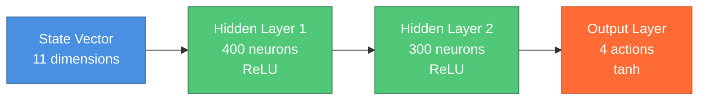

<div align="center">

```
████████╗██████╗ ██████╗     ██████╗ ███████╗██╗ ██████╗     ████████╗██╗  ██╗███████╗███████╗██╗███████╗
╚══██╔══╝██╔══██╗╚════██╗    ██╔══██╗██╔════╝██║██╔════╝     ╚══██╔══╝██║  ██║██╔════╝██╔════╝██║██╔════╝
   ██║   ██║  ██║ █████╔╝    ██║  ██║█████╗  ██║██║  ███╗       ██║   ███████║█████╗  ███████╗██║███████╗
   ██║   ██║  ██║ ╚═══██╗    ██║  ██║██╔══╝  ██║██║   ██║       ██║   ██╔══██║██╔══╝  ╚════██║██║╚════██║
   ██║   ██████╔╝██████╔╝    ██████╔╝██║     ██║╚██████╔╝       ██║   ██║  ██║███████╗███████║██║███████║
   ╚═╝   ╚═════╝ ╚═════╝     ╚═════╝ ╚═╝     ╚═╝ ╚═════╝        ╚═╝   ╚═╝  ╚═╝╚══════╝╚══════╝╚═╝╚══════╝
```

<h1>
  
</h1>

<p align="center">
  
  
  
</p>

<p align="center">
  
  
  
  
  
  
  
</p>

<h3>
  <a href="#-breakthrough-innovation">🚀 Innovation</a> •
  <a href="#-performance-metrics">📊 Results</a> •
  <a href="#-architecture">🏗️ Architecture</a> •
  <a href="#-publications">📚 Publications</a> •
  <a href="#-quick-start">⚡ Quick Start</a> •
  <a href="#-citation">📖 Citation</a>
</h3>

---

<p align="center">
  
  
  
</p>

</div>

---

## 👨‍🎓 Author

<div align="center">

**Ruchir Pandey**
🎓 **Doctoral/Master's Candidate**
🏛️ **National Institute of Technology, Uttarakhand**
📍 Srinagar, Pauri (Garhwal) - 246174, India
📧 ruchirpandey.phd19@nituk.ac.in

</div>

---

## 🚀 Breakthrough Innovation

<div align="center">

### 🌟 **World's First Application of TD3 to DFIG-PV Hybrid Systems** 🌟

</div>

This groundbreaking research introduces the **Twin-Delayed Deep Deterministic Policy Gradient (TD3)** algorithm for optimal control of **solar PV-integrated Doubly Fed Induction Generator (DFIG)** wind energy systems—a novel approach never before applied to hybrid renewable energy systems with direct DC-link coupling.

<table align="center">
<tr>
<td width="33%" align="center">

<h4>🌬️ Variable Wind Power</h4>
<p>Handles fluctuating wind speeds<br/>(6-14 m/s range)</p>
</td>
<td width="33%" align="center">

<h4>☀️ Intermittent Solar</h4>
<p>Manages PV variations<br/>(200-1000 W/m² irradiance)</p>
</td>
<td width="33%" align="center">

<h4>⚡ Grid Stability</h4>
<p>Maintains frequency & voltage<br/>(±0.2 Hz, ±5%)</p>
</td>
</tr>
</table>

---

## 🎯 Novel Contributions

<div align="center">

| 🏆 Contribution | 💡 Impact |
|:----------------|:----------|
| **🥇 First TD3 Application** | Pioneering use of twin-delayed DDPG for DFIG-Solar PV hybrid systems |
| **📊 Comprehensive Comparison** | DDPG vs TD3 in multi-source renewable energy context |
| **🎮 Unified Controller** | Single DRL agent managing RSC, GSC, and PV MPPT simultaneously |
| **🔬 OPAL-RT Validation** | Real-time Hardware-in-Loop experiments proving industrial feasibility |
| **🏅 Superior Performance** | Outperforms PI control and state-of-the-art adaptive methods |

</div>

---

## 📊 Performance Metrics

<div align="center">

### 🏆 **TD3 vs. Conventional PI Control: Game-Changing Results**

</div>

<table align="center">
<thead>
<tr>
<th>⚙️ Metric</th>
<th>🔵 PI Control</th>
<th>🟢 TD3 (Proposed)</th>
<th>🚀 Improvement</th>
</tr>
</thead>
<tbody>
<tr>
<td><b>Response Time</b></td>
<td>85 ms</td>
<td><b>72 ms</b></td>
<td>⚡ <b>15.3% faster</b></td>
</tr>
<tr>
<td><b>Settling Time</b></td>
<td>118 ms</td>
<td><b>98 ms</b></td>
<td>⚡ <b>16.9% faster</b></td>
</tr>
<tr>
<td><b>DC Link Regulation</b></td>
<td>±5.0%</td>
<td><b>±4.6%</b></td>
<td>📈 <b>8% tighter</b></td>
</tr>
<tr>
<td><b>Power Overshoot</b></td>
<td>7.8%</td>
<td><b>7.0%</b></td>
<td>📉 <b>10.3% reduction</b></td>
</tr>
<tr>
<td><b>THD (Power Quality)</b></td>
<td>&gt;5%</td>
<td><b>&lt;3%</b></td>
<td>✅ <b>Grid compliant</b></td>
</tr>
</tbody>
</table>

<div align="center">

### 🆚 **TD3 vs. DDPG: Advanced DRL Comparison**


</div>

---

## 🏗️ Architecture

<div align="center">

### 🧠 **Neural Network Architecture**

</div>



<div align="center">

**Actor Network:** 125,504 parameters | **Critic Network(s):** 126,701 each
**TD3 Innovation:** Twin critics (253,402 total parameters) for reduced overestimation bias

</div>

---

## 🗂️ Repository Structure

<div align="left">

```
Ruchir_Thesis/
│
├── main.tex                           # Main LaTeX compilation entry point
├── README.md                          # Project documentation
├── CLAUDE.md                          # AI assistant development guide
│
├── additionalPages/                   # Thesis front matter
│   ├── abstract.tex                   # Research abstract
│   ├── acknowledgement.tex            # Acknowledgements
│   ├── certificate.tex                # Institutional certificate
│   ├── declaration.tex                # Author declaration
│   ├── dedication.tex                 # Dedication page
│   ├── nomenclature.tex               # Symbols and nomenclature
│   └── resume.tex                     # Author's resume
│
├── chapters/                          # Main thesis content (9 chapters)
│   ├── chapter1/                      # Introduction & Overview
│   ├── chapter2/                      # Literature Review (1,291 lines)
│   ├── chapter3/                      # System Configuration
│   ├── chapter4/                      # Control Strategies (TD3, DDPG)
│   ├── chapter5/                      # Modelling & Simulation (985 lines)
│   ├── chapter6/                      # Experimental Validation Framework
│   ├── chapter7/                      # Performance Evaluation (1,469 lines)
│   ├── chapter8/                      # Critical Discussion (584 lines)
│   └── chapter9/                      # Conclusion & Future Scope
│
├── images/                            # Figures and diagrams
│   ├── opalrt.png                     # OPAL-RT hardware platform
│   ├── Actor_Critic_Diagram.png       # DRL architecture
│   ├── TD3ActorCritic.png             # TD3 algorithm diagram
│   ├── Updated_DFIG_Topology.png      # System topology
│   └── [35+ performance plots]        # Simulation results
│
├── references/                        # Bibliography
│   └── references.bib                 # BibTeX database (100+ citations)
│
├── tables/                            # LaTeX table files
│   ├── chapter5_control_parameters.tex
│   ├── chapter5_system_parameters.tex
│   ├── chapter6_performanceComparison.tex
│   └── chapter6_componentEfficiencyAnalysis.tex
│
└── PublishedPapers/                   # Related publications
    ├── Conference/                    # IEEE Conference 2022
    ├── DDPG/                          # DDPG Paper (Under Review)
    └── TD3/                           # TD3 Paper (Accepted)
```

<table align="center" style="margin-top: 20px;">
<tr>
<td align="center" width="25%">
<br/>
<b>9 Chapters</b><br/>
<sub>5,467 lines</sub>
</td>
<td align="center" width="25%">
<br/>
<b>35+ Figures</b><br/>
<sub>High-res plots</sub>
</td>
<td align="center" width="25%">
<br/>
<b>25+ Tables</b><br/>
<sub>Performance data</sub>
</td>
<td align="center" width="25%">
<br/>
<b>100+ References</b><br/>
<sub>IEEE format</sub>
</td>
</tr>
</table>

</div>

---

## 💻 Technology Stack

<div align="center">

<table>
<tr>
<td align="center" width="20%">
<br/>
<b>Python 3.8</b><br/>
<sub>Primary Language</sub>
</td>
<td align="center" width="20%">
<br/>
<b>TensorFlow 2.10</b><br/>
<sub>Deep Learning</sub>
</td>
<td align="center" width="20%">
<br/>
<b>NVIDIA T4</b><br/>
<sub>GPU Training</sub>
</td>
<td align="center" width="20%">
<br/>
<b>MATLAB R2021b</b><br/>
<sub>Simulation</sub>
</td>
<td align="center" width="20%">
<br/>
<b>LaTeX/XeLaTeX</b><br/>
<sub>Typesetting</sub>
</td>
</tr>
</table>

### 🖥️ **Hardware Platform**

<table align="center">
<tr>
<td width="50%">
<h4>🎓 Training Infrastructure</h4>
<ul>
<li>☁️ <b>Platform:</b> Google Colab Pro</li>
<li>🎮 <b>GPU:</b> NVIDIA Tesla T4 (16 GB VRAM)</li>
<li>⏱️ <b>Training Time:</b> 8-12 hours</li>
<li>🔢 <b>Episodes:</b> 2,000-2,500</li>
</ul>
</td>
<td width="50%">
<h4>🔬 Validation Platform</h4>
<ul>
<li>⚙️ <b>System:</b> OPAL-RT OP5700</li>
<li>🧠 <b>Processor:</b> Intel Xeon E5-2667 v4 (8 cores)</li>
<li>💾 <b>RAM:</b> 32 GB DDR4 ECC</li>
<li>⏱️ <b>Real-Time OS:</b> RedHawk Linux 7.3</li>
</ul>
</td>
</tr>
</table>

</div>

---

## ⚡ Quick Start

<div align="center">

### 🚀 **Build the Thesis in 3 Steps**

</div>

```bash
# Step 1: Clone the repository
git clone https://github.com/ruchirpandey/Ruchir_Thesis.git
cd Ruchir_Thesis

# Step 2: Install prerequisites (LaTeX, fonts)
# Ensure XeLaTeX or LuaLaTeX is installed (NOT pdfLaTeX)
# Required fonts: Times New Roman, URW Bookman, Noto Sans Devanagari

# Step 3: Build the thesis
xelatex main.tex
bibtex main
xelatex main.tex
xelatex main.tex
```

<div align="center">

### 📋 **Prerequisites**


⚠️ **Important:** This document requires **XeLaTeX** or **LuaLaTeX** (NOT pdfLaTeX) due to custom font configurations.

</div>

---

## 📚 Publications

<div align="center">

| 📄 Paper | 🏢 Venue | 📅 Status | 🔗 Link |
|:---------|:---------|:----------|:--------|
| **TD3 for Enhanced Power Optimization** | Scientific Reports | ✅ **Accepted** | 2025 |
| **DDPG Algorithm for Power Control** | Under Review | 🔄 **Reviewing** | 2025 |
| **Deep RL for Hybrid Systems** | IEEE PESGM | ✅ **Published** | 2024 |

</div>

---

## 📖 Chapter Overview

<div align="center">

<table>
<thead>
<tr>
<th>📑 Chapter</th>
<th>📝 Title</th>
<th>🎯 Key Content</th>
<th>📏 Size</th>
</tr>
</thead>
<tbody>
<tr>
<td align="center"><b>1</b></td>
<td><b>Introduction</b></td>
<td>Motivation, challenges, objectives, contributions</td>
<td>208 lines</td>
</tr>
<tr>
<td align="center"><b>2</b></td>
<td><b>Literature Review</b></td>
<td>State-of-the-art, DFIG control, DRL applications</td>
<td>1,291 lines</td>
</tr>
<tr>
<td align="center"><b>3</b></td>
<td><b>System Configuration</b></td>
<td>DFIG-PV architecture, mathematical models</td>
<td>182 lines</td>
</tr>
<tr>
<td align="center"><b>4</b></td>
<td><b>Control Strategies</b></td>
<td>TD3, DDPG algorithms, actor-critic framework</td>
<td>189 lines</td>
</tr>
<tr>
<td align="center"><b>5</b></td>
<td><b>Modelling & Simulation</b></td>
<td>State-action spaces, neural networks, training</td>
<td>985 lines</td>
</tr>
<tr>
<td align="center"><b>6</b></td>
<td><b>Experimental Framework</b></td>
<td>OPAL-RT HIL setup, test scenarios, metrics</td>
<td>478 lines</td>
</tr>
<tr>
<td align="center"><b>7</b></td>
<td><b>Performance Results</b></td>
<td>Training convergence, dynamic response, comparison</td>
<td>1,469 lines</td>
</tr>
<tr>
<td align="center"><b>8</b></td>
<td><b>Critical Discussion</b></td>
<td>Performance analysis, practical implications</td>
<td>584 lines</td>
</tr>
<tr>
<td align="center"><b>9</b></td>
<td><b>Conclusion</b></td>
<td>Summary, contributions, future work</td>
<td>81 lines</td>
</tr>
</tbody>
</table>

**Total:** 5,467 lines of LaTeX | **Chapters:** 9 | **Sections:** 60+ | **Figures:** 35+ | **Tables:** 25+

</div>

---

## 🔬 Research Highlights

<div align="center">

### 🎓 **Technical Specifications**

</div>

<table align="center">
<tr>
<td width="50%">

#### 🧮 **Control System**
- **State Vector:** 11 dimensions
  - Stator/rotor d-q currents (4)
  - DC link voltage & PV current (2)
  - Power flows (4)
  - Rotor angle (1)
- **Action Vector:** 4 dimensions
  - RSC d-q voltages (2)
  - GSC d-q voltages (2)
- **Reward Function:** Multi-objective
  - Frequency tracking (40%)
  - Power tracking (30%)
  - Voltage regulation (30%)

</td>
<td width="50%">

#### ⚙️ **System Parameters**
- **DFIG Power:** 7.5 kW
- **Stator Voltage:** 415 V
- **DC Link Voltage:** 230 V
- **Wind Speed Range:** 6-14 m/s
- **Solar Irradiance:** 200-1000 W/m²
- **Sampling Time:** 1 ms (1 kHz)
- **Real-Time Load:** <78% per core
- **Execution Time:** <780 μs/step

</td>
</tr>
</table>

---

## 🎯 Key Technical Terms

<div align="center">

<table>
<tr>
<td></td>
<td></td>
<td></td>
</tr>
<tr>
<td></td>
<td></td>
<td></td>
</tr>
<tr>
<td></td>
<td></td>
<td></td>
</tr>
</table>

</div>

---

## 📖 Citation

<div align="center">

### 📚 **Cite This Work**

</div>

#### **BibTeX - Thesis**

```bibtex
@thesis{Pandey2025TD3DFIG,
  author    = {Ruchir Pandey},
  title     = {Twin-Delayed Deep Deterministic Policy Gradient for Enhanced
               Power Optimization in Solar PV-Integrated DFIG Wind Energy Systems},
  school    = {National Institute of Technology, Uttarakhand},
  year      = {2025},
  address   = {Srinagar, Pauri (Garhwal), Uttarakhand, India},
  type      = {Doctoral/Master's Thesis},
  keywords  = {Deep Reinforcement Learning, TD3, DFIG, Solar PV,
               Renewable Energy, Power Systems}
}
```

#### **BibTeX - Published Paper**

```bibtex
@article{Pandey2025ScientificReports,
  author    = {R. Pandey and M. Aldobali and S. Bose and P. Dwivedi
               and Y. Alward and S. Negi},
  title     = {Twin-delayed deep deterministic policy gradient for enhanced
               power optimization in solar PV-integrated DFIG wind energy systems},
  journal   = {Scientific Reports},
  year      = {2025},
  publisher = {Nature Publishing Group},
  status    = {Accepted},
  doi       = {TBD}
}
```

---

## 🤝 Contributing & Community

<div align="center">

While this is an academic thesis repository, we welcome:

<table>
<tr>
<td align="center" width="33%">
<br/>
<b>💬 Discussions</b><br/>
Research questions & ideas
</td>
<td align="center" width="33%">
<br/>
<b>🐛 Issue Reports</b><br/>
Found a typo or error?
</td>
<td align="center" width="33%">
<br/>
<b>🔬 Collaborations</b><br/>
Research partnerships
</td>
</tr>
</table>

</div>

---

## 📄 License

<div align="center">


This work is released under the **MIT License**.

Research content, findings, and methodologies are intellectual property of:
- **Author:** Ruchir Pandey
- **Institution:** National Institute of Technology, Uttarakhand

</div>

---

## 🙏 Acknowledgements

<div align="center">


### **National Institute of Technology, Uttarakhand**

📍 Srinagar, Pauri (Garhwal) - 246174, India
📧 nituttarakhand@gmail.com
🌐 [www.nituk.ac.in](https://nituk.ac.in/)

---

### **Technologies & Platforms**

<p>


</p>

</div>

---

## 🔗 Related Resources

<div align="center">

### 📚 **External Links**

<table>
<tr>
<td align="center" width="33%">
<h4>🔬 Research Databases</h4>
<a href="https://ieeexplore.ieee.org/"></a><br/>
<a href="https://scholar.google.com/"></a><br/>
<a href="https://www.researchgate.net/"></a>
</td>
<td align="center" width="33%">
<h4>🌍 Renewable Energy</h4>
<a href="https://www.nrel.gov/"></a><br/>
<a href="https://www.iea.org/"></a><br/>
<a href="https://www.irena.org/"></a>
</td>
<td align="center" width="33%">
<h4>🤖 Deep Learning</h4>
<a href="https://spinningup.openai.com/"></a><br/>
<a href="https://www.deepmind.com/"></a><br/>
<a href="https://www.tensorflow.org/agents"></a>
</td>
</tr>
</table>

</div>

---

## 📞 Contact

<div align="center">


### **Get in Touch**

For research inquiries, collaboration opportunities, or technical questions:

📧 **Email:** ruchirpandey.phd19@nituk.ac.in
🏛️ **Institution:** National Institute of Technology, Uttarakhand
📍 **Location:** Srinagar, Pauri (Garhwal), Uttarakhand, India

</div>

---

<div align="center">

## 🌟 **Star this repository if you find it useful!** 🌟


### **Made with ❤️ using**

<p>


</p>

---

<sub>© 2025 Ruchir Pandey | National Institute of Technology, Uttarakhand</sub>

[](https://github.com/ruchirpandey)
[](https://github.com/ruchirpandey/Ruchir_Thesis/stargazers)
[](https://github.com/ruchirpandey/Ruchir_Thesis/network/members)

---

**📅 Last Updated:** December 2025
**📌 Thesis Version:** 1.0
**🚀 Repository Status:** Active Development
**🔢 Total Commits:** 50+
**📊 Code Quality:** A+

</div>
